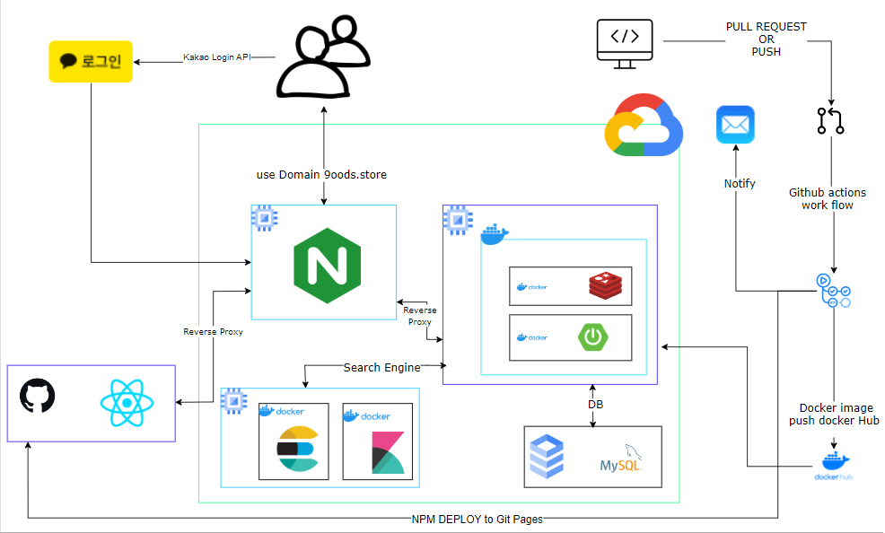
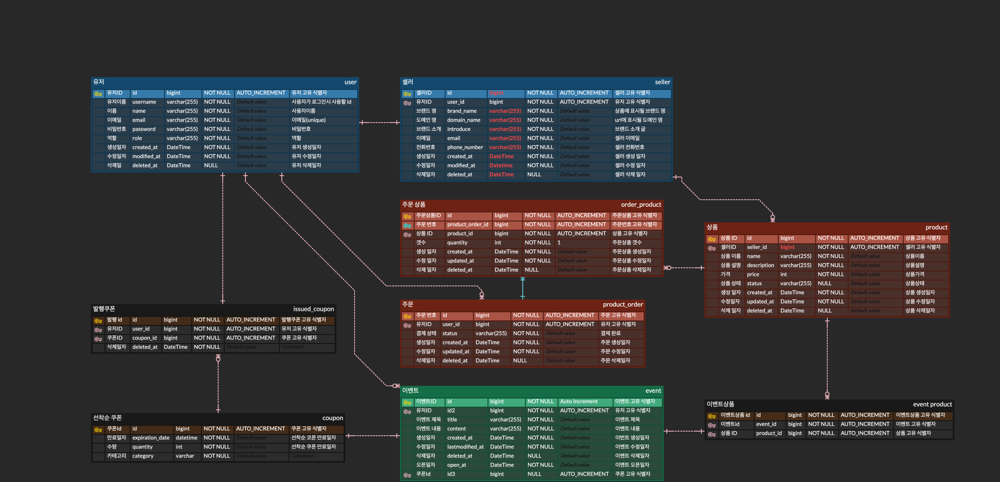
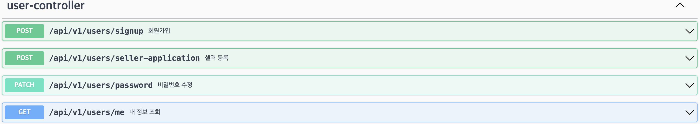
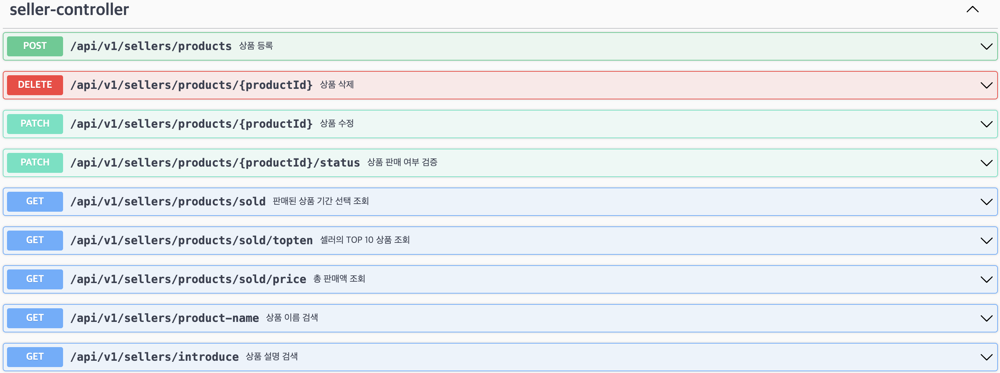
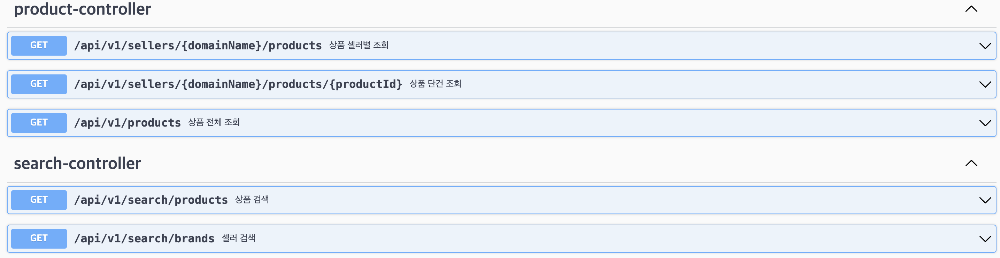
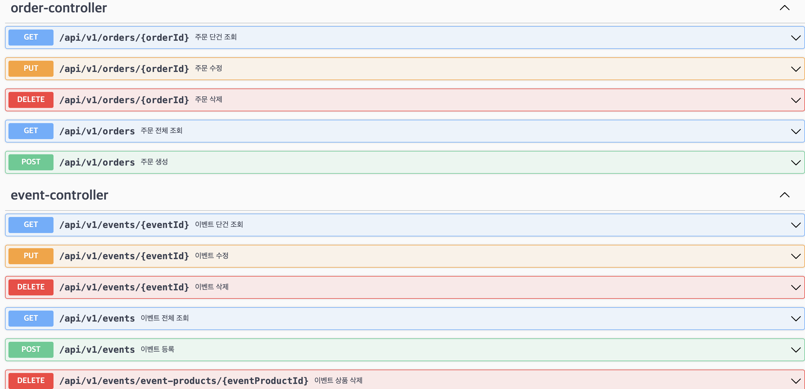
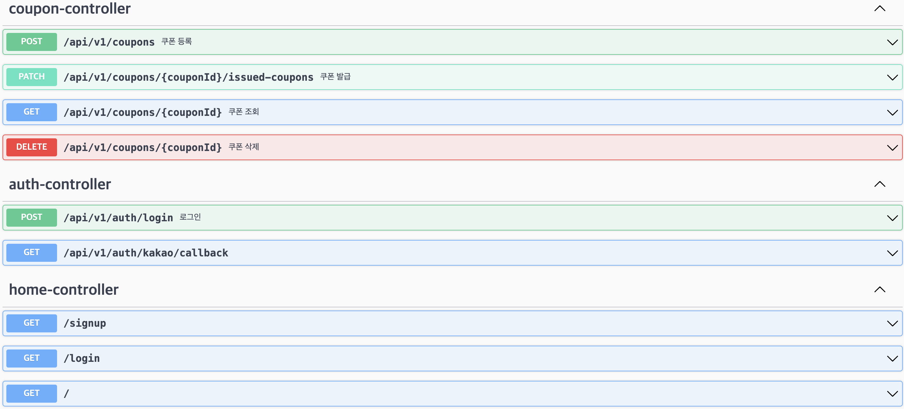
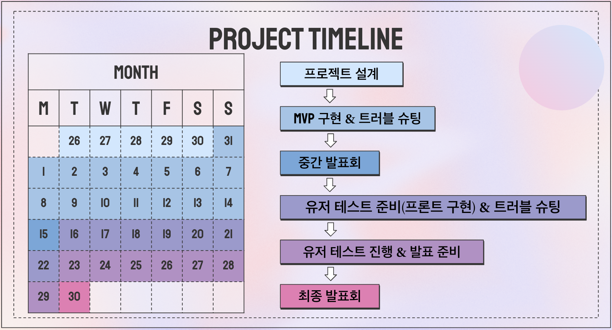

# 9OODS

## Table of Contents
- [프로젝트 개요](#프로젝트-개요)
- [개발환경](#development-environment)
  - [Architecture](#architecture)
  - [Backend](#backend)
  - [Database](#database)
  - [InfraStruture](#infrastructure)
  - [Monitoring](#monitoring)
- [ERD](#erd)
- [API 명세서](#api-명세서)
- [프로젝트 스케쥴](#프로젝트-타임라인)

## 프로젝트 개요

- 프로젝트 명 : 9OODS
- 소개
  - 9OODS는 유튜버, 캐릭터, 연예인 등 모든 크리에이터의 굿즈를 사고 팔 수 있는 이커머스 서비스 입니다.

---

<h2 id="development-environment">

개발환경

</h2>

##### Architecture

##### Backend

- JDK 17
- SpringBoot 3.2.X
- SpringSecurity 3.2.X
- ElasticSearch 8.13.X

##### Database

- MySQL 8.0.X
- Redis 3.0.X

##### InfraStructure

- GCP ComputeEngine
- Docker
- GitHub Actions

##### Monitoring

- Kibana 8.13.X

---

## ERD

---

## API 명세서

 펼치기 

---

## 프로젝트 타임라인

