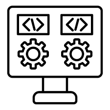

# 9OODS

## Table of Contents
- [프로젝트 개요](#project-outline)
- [개발환경](#development-environment)
  - [Architecture](#architecture)
  - [Backend](#backend)
  - [Database](#database)
  - [InfraStruture](#infrastructure)
  - [Monitoring](#monitoring)
- [ERD](#erd)
- [API 명세서](#api)
- [프로젝트 스케쥴](#schedule)

---

<h3 id="project-outline">

프로젝트 개요
</h3>

- 프로젝트 명 : 9OODS
- 소개
  - 9OODS는 유튜버, 캐릭터, 연예인 등 모든 크리에이터의 굿즈를 사고 팔 수 있는 이커머스 서비스 입니다.
  - 9OODS는 일반 유저(구매자)와 셀러(판매자)로 나눠집니다.
  - 구매자는 상품 또는 브랜드를 검색할 수 있고, 상품을 검색 및 조회할 수 있습니다.
  - 셀러는 상품 등록, 수정, 삭제, 판매된 상품 조회, 기간 내 판매된 총 금액 및 많이 판매된 상품 탑텐을 조회할 수 있습니다.

---

<h3 id="development-environment">

개발환경
</h3>

##### Architecture

##### Backend

- JDK 17
- SpringBoot 3.2.X
- SpringSecurity 3.2.X
- ElasticSearch 8.13.X

##### Database

- MySQL 8.0.X
- Redis 7.0.X

##### InfraStructure

- GCP ComputeEngine
- Docker
- GitHub Actions

##### Monitoring

- Kibana 8.13.X

---

<h3 id="erd">

ERD
</h3>

---

<h3 id="api">

API 명세서
</h3>

 펼치기 

---

<h3 id="schedule">

프로젝트 스케쥴
</h3>

